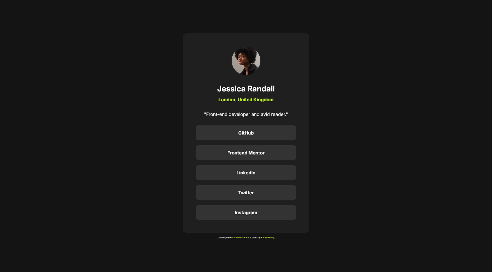

# Frontend Mentor - Social links profile solution

This is a solution to the [Social links profile challenge on Frontend Mentor](https://www.frontendmentor.io/challenges/social-links-profile-UG32l9m6dQ). Frontend Mentor challenges help you improve your coding skills by building realistic projects. 

## Table of contents

- [Overview](#overview)
  - [The challenge](#the-challenge)
  - [Screenshot](#screenshot)
  - [Links](#links)
- [My process](#my-process)
  - [Built with](#built-with)
  - [What I learned](#what-i-learned)
  - [Continued development](#continued-development)
  - [Useful resources](#useful-resources)
- [Author](#author)

## Overview

### The challenge

Users should be able to:

- See hover and focus states for all interactive elements on the page

### Screenshot



### Links

- Solution URL: [solution](https://github.com/huang-emily/social-links-profile)
- Live Site URL: [live site](https://huang-emily.github.io/social-links-profile/)

## My process

### Built with

- Semantic HTML5 markup
- CSS custom properties
- Flexbox
- CSS Grid
- Mobile-first workflow

### What I learned

From the Blog Preview exercise, I was exploring how to use ```clamp()```, but what made it annoying to work with was using the right value for the "preferred value" or middle value used in the function. 

I saw there was some slight padding changes when changing between desktop, tablet, and mobile view, so I decided to bring over the ```clamp()``` function again. 

```css
.profile-card {
    padding: clamp(2.4rem, 6vw, 4rem);
}
```

Additionally, I learned about ```:nth-child()``` when overriding one of the ```margin-bottom``` properties I applied to the button group. 


```css
.button-group > button {
    margin-bottom: 1.6rem;
}

.button-group > button:nth-child(5) {
    margin-bottom: 0rem;
}
```

With this, I didn't need to re-write ```margin-bottom: 1.6rem;``` four times. I also learned about ```:hover```, but it wasn't as complicated to learn compared to the ```clamp()```.

I also learned a bit more about ```justify-content``` vs. ```align-items``` where the prior helps with horizontal movement and the later helps with vertical movement. Obviously, this is a rather simplified version of what they actually do, but it's helped me understand what I need for a specific use case which is centering one singular container on a page.


### Continued development

I'll likely continue to keep exploring different ways to create responsive designs without media queries. What helped decided on the "preferred value" or middle value of the ```clamp()``` function was using the Inspect option in the conntext menu. That helped me see how much the elements were actually changing within the window. 


### Useful resources

- [A Quick Way to Remember the Difference Between `justify-content` and `align-items`](https://css-tricks.com/a-quick-way-to-remember-difference-between-justify-content-align-items/) - This is the article that helped simplified the two. Again, they outline that is it a gross simplification, but it got what I needed. 

## Author

- Website - [Emily Huang](https://www.emilyhuang.io/)
- Frontend Mentor - [@huang-emily](https://www.frontendmentor.io/profile/huang-emily)
